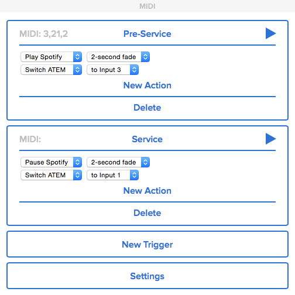

#midi-bridge

A utility for ProPresenter 6 and midi devices to control iTunes, Spotify and ATEM switchers.

##Install

	$ npm install midi-bridge

##Run

	$ cd node_modules/midi-bridge
	$ node main.js

Manage Triggers and Actions via the GUI: [http://localhost:3030](http://localhost:3030):

If you don't have a Midi Device, you can use a Virtual Midi Device such as [MidiKeys](http://www.manyetas.com/creed/midikeys.html) to try it out.

##Remote Access

* Access the GUI from other devices at http://your-ip-address:3030 (eg. http://192.168.0.19:3030)
* There's even an icon for adding Midi Bridge to your smartphone's homescreen;)